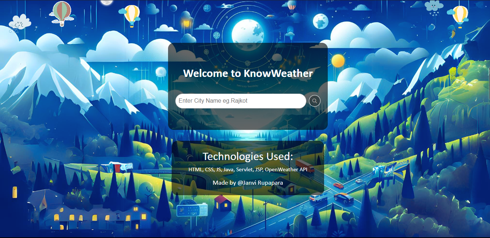
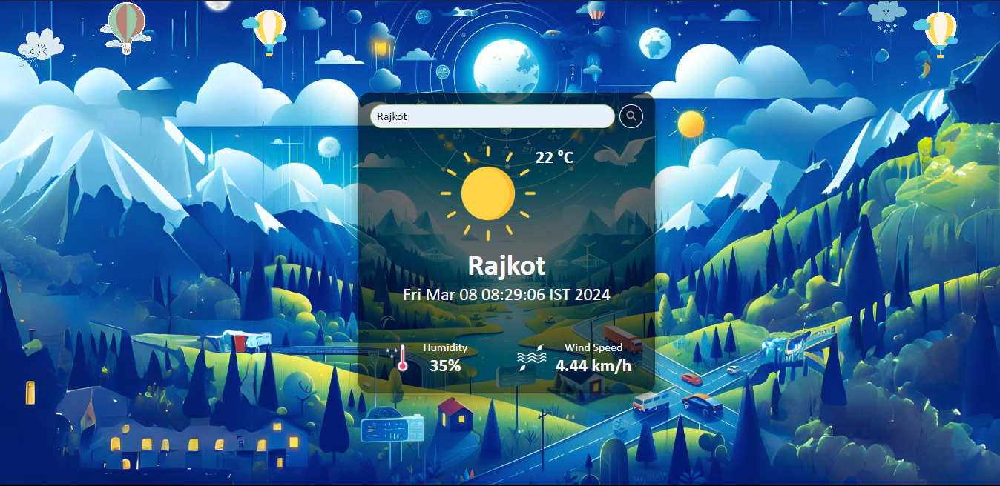
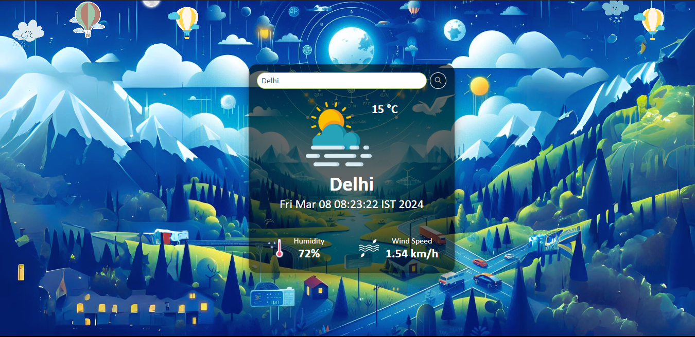
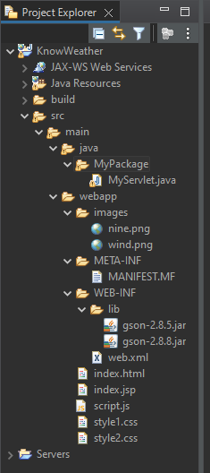

# KnowWeather Webapp

## Overview

KnowWeather is a simple web application built using Java EE technologies that allows users to retrieve current weather conditions for a given city. By entering the city name, the application fetches data from the OpenWeather API and displays information such as temperature, humidity, wind speed, date, and time.
  

 

 

 

## Technologies Used

- Eclipse Java EE (Integrated Development Environment)
- Servlet
- JSP (JavaServer Pages)
- HTML
- CSS
- JavaScript

## How to Run the Code

Follow these steps to run the KnowWeather Webapp on your local machine:

1. Open Eclipse IDE (Java EE version) and create a new dynamic web project.
2. Right-click on the project name and create a new Servlet file with the package name and class name "MyServlet."
3. Again, right-click on the project name and create JSP, HTML, JavaScript, and CSS files with the following names respectively: "index.jsp", "index.html", "script.js", and "style1.css", "style2.css".
4. Create a folder named "images" in the web app directory and place your image files inside it.
5. Copy the existing code from your previous project files into the newly created files, ensuring that the filenames match the specified names.
6. If you haven't configured a server in your Eclipse workspace, set up a server such as Apache Tomcat version 10.1.
7. Do not modify the `web.xml` file, as it will be automatically generated.
8. Get your APIKey and paste it in apikey = `Apni-API-KEY-daalo` variable in MyServlet.java file.

## Note

This project is configured to use the OpenWeather API for fetching weather data. Make sure you have an API key from OpenWeather and update the relevant code accordingly.

Make Sure You have such Folder structure... 
 

## Learning Mode 💛

Feel free to explore the codebase and make modifications. If you have any questions or suggestions, don't hesitate to reach out. Happy coding!

